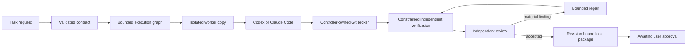

# Portable Agentkit

**A portable, provider-neutral harness for bounded AI-assisted software delivery.**

[](https://www.python.org/)
[](#requirements)
[](#support-matrix)
[](#project-status)

Portable Agentkit turns an engineering request into a validated task contract, a bounded execution graph, isolated implementation work, independent verification and review, and a revision-bound local approval package. It integrates with installed Codex and Claude Code CLIs while keeping task state, budgets, permissions and approvals under deterministic controller control.

The repository also includes ten audited engineering skills, seven domain procedures, strict handoff schemas, disposable fixtures and a regression suite. It uses only the Python standard library at runtime and works directly from a checkout.

> [!IMPORTANT]
> Automated code execution is currently supported only for controller-created disposable workspaces under the tested macOS profile. Personal repositories, arbitrary local projects, Linux/Windows workers, GPU hosts and unattended untrusted code are outside the validated boundary.

## Why Portable Agentkit?

Most agent demos stop when a model says the task is complete. Portable Agentkit treats model output as an untrusted proposal and requires controller-observed evidence before work can advance.

- **Provider-neutral execution.** Codex or Claude Code can implement or review through separate adapters and a shared result contract.
- **Durable control.** SQLite-backed state transitions, event history, budgets, checkpoints and evidence survive controller restarts.
- **Bounded workflows.** Call, timeout, concurrency, repair and graph limits are reserved and enforced by controller code.
- **Independent checks.** Verification runs against the candidate revision in a separate constrained copy with controller-owned acceptance tests.
- **Isolated assignments.** Decomposed fixture tasks use separate branches and worktrees, followed by a controller-owned integration step.
- **Safe authentication recovery.** Missing or expired subscription login pauses the exact stage and resumes only after lifecycle, candidate and evidence revalidation.
- **Audited context.** Workers receive only role-relevant skill content, rehashed against the version recorded in the plan.
- **Approval separation.** A worker cannot approve publication. The workflow stops at a local package bound to the exact candidate revision.

## Project status

Portable Agentkit is an experimental engineering toolkit, currently through Phase 4 of its roadmap.

| Area | Status |
|---|---|
| Audited skill and domain pack | Implemented and tested offline |
| Strict handoff validation | Implemented; validated documents grant no authority |
| Codex and Claude Code adapters | Implemented with structured results, redacted raw events, cancellation and unknown-preserving usage |
| Durable delivery controller | Implemented for controller-created disposable repositories |
| Authentication recovery | Implemented and fixture-tested; interactive browser/device recovery has not been live-validated |
| Phase 4 task workflow | Deterministic and fixture-tested through a local approval package |
| Corrected Phase 4 live path | Awaiting one new bounded validation run |
| General repository onboarding | Not implemented |
| GitHub publication, merge and deployment | Not implemented in the toolkit |

The archived Phase 4 live demonstration belongs to commit `af80791`. It is retained as historical evidence and does not validate the corrected adapter revision. See the [Phase 4 validation report](docs/phase4-validation-report.md).

## Requirements

- Python 3.9 or newer
- Git for workflows that create branches and worktrees
- macOS for the currently validated execution sandbox
- Optional: subscription-authenticated Codex and/or Claude Code CLI for explicitly authorized live disposable runs

Runtime code has no third-party Python dependencies. The toolkit does not install CLIs, plugins or credentials and does not modify global CLI configuration.

## Quick start

Clone the repository and run the offline checks:

```sh
git clone https://github.com/adityachaturvedii/portable-agentkit.git
cd portable-agentkit

python3 -m agentkit check
python3 -m unittest discover -s tests -v
```

Explore the audited skill pack:

```sh
python3 -m agentkit list
python3 -m agentkit select diagnose
python3 -m agentkit show fault-diagnosis --domain backend-database
python3 -m agentkit validate contracts/examples/fault-diagnosis.json
```

`select` uses an explicit intent from `list`; it is not free-form model routing. `validate` checks structure and consistency only. It never executes commands or follows paths supplied by a handoff.

## Run a complete offline task

The default task workflow uses deterministic fake providers and a controller-created fixture, so it consumes no model quota:

```sh
python3 -m agentkit task fixtures

python3 -m agentkit task submit \
  --root /tmp/agentkit-task \
  --task-id calculator-demo \
  --fixture calculator \
  --request "Repair the calculator fixture"

python3 -m agentkit task plan \
  --root /tmp/agentkit-task \
  --task-id calculator-demo

python3 -m agentkit task start \
  --root /tmp/agentkit-task \
  --task-id calculator-demo

python3 -m agentkit task status \
  --root /tmp/agentkit-task \
  --task-id calculator-demo

python3 -m agentkit task package \
  --root /tmp/agentkit-task \
  --task-id calculator-demo
```

The workflow stops at `awaiting_pr_approval`. It does not push, open a pull request, merge or deploy.

The built-in fixtures are intentionally narrow:

- `calculator` exercises a single implementation, verification and review path.
- `text-metrics` and `inventory` exercise fixture-defined decomposition, isolated specialist worktrees, sequential execution and controller-owned integration.

## How it works



The controller owns task state, transitions, budgets, Git mutations, evidence and approval records. Provider output can propose a change or finding, but cannot expand filesystem or network authority, alter budgets, mark evidence as passing or grant approval.

For decomposed tasks, each specialist writes to its own worker copy and assigned worktree. The controller validates allowed paths, commits accepted changes, integrates disjoint contributions and then verifies the combined candidate. The current driver executes ready specialist nodes sequentially; concurrent scheduling and autonomous management agents are not implemented.

## Live CLI integration

Start with the read-only diagnostic:

```sh
python3 -m agentkit doctor
python3 -m agentkit auth-status codex
python3 -m agentkit auth-status claude
```

`doctor` reports installed versions, advertised features, sanitized authentication observations and sandbox availability. It does not run inference or modify settings. Unknown billing, model, usage or capability information remains unknown.

A live disposable task requires both `--live` and explicit subscription-smoke authorization:

```sh
python3 -m agentkit task start \
  --root /tmp/agentkit-task \
  --task-id calculator-demo \
  --live \
  --authorize-subscription-smoke
```

Live execution uses the installed CLI's existing subscription authentication. Portable Agentkit does not introduce API keys, enable paid fallback, purchase credits or change authentication methods. If authentication is missing or expired, the task pauses at `authentication_required`. The official interactive login flow runs in an attached terminal and keeps passwords, MFA, tokens, codes and raw login output out of controller evidence and model context. See [guided authentication recovery](docs/authentication-recovery.md).

Do not include live commands in ordinary CI. They are intended only for small, explicitly authorized disposable checks.

## CLI overview

| Command | Purpose | Inference |
|---|---|---|
| `python3 -m agentkit list`, `select`, `show` | Discover and render audited skills and domain procedures | No |
| `python3 -m agentkit validate` | Validate an untrusted structured handoff | No |
| `python3 -m agentkit check` | Check sources, references, notices and blocked examples | No |
| `python3 -m agentkit doctor` | Inspect local CLI and sandbox capabilities read-only | No |
| `python3 -m agentkit boundary-check` | Run disposable filesystem boundary canaries | No |
| `python3 -m agentkit lifecycle-check` | Exercise timeout, cancellation and child cleanup fixtures | No |
| `python3 -m agentkit smoke` | Run a bounded model-only provider check | Explicit authorization required |
| `python3 -m agentkit execution-check` | Run a bounded disposable coding check | Explicit authorization required |
| `python3 -m agentkit controller-demo` | Exercise the Phase 3 delivery controller | Fake by default; live is opt-in |
| `python3 -m agentkit auth-status`, `auth-login`, `auth-reconcile` | Inspect or recover official subscription login | Login is interactive and uncaptured |
| `python3 -m agentkit task ...` | Submit, plan, run, inspect, cancel, resume and package Phase 4 fixture tasks | Fake by default; live is opt-in |

Run `python3 -m agentkit --help` or a subcommand's `--help` for the exact options.

## Trust and safety model

Portable Agentkit is built around explicit boundaries:

1. **The controller is authoritative.** Model responses cannot change permissions, budgets, evidence state or approval state.
2. **Git worktrees are not sandboxes.** Workers receive tracked-file copies without controller state or shared Git metadata. The controller alone applies validated changes.
3. **Verification is separate.** Acceptance tests run in a fresh candidate copy under the tested read-only/no-network macOS profile.
4. **Uncertainty blocks replacement.** After a controller interruption, executions with uncertain process ownership must be reconciled before relaunch.
5. **Usage stays honest.** Missing token and cost data remains `unknown`; an estimated cost is never presented as billed cost.
6. **Publication is a separate authority.** A local approval package is evidence for a decision, not the decision itself.

Read the [threat model](docs/threat-model.md), [controller contracts](docs/controller-contracts.md), [runtime contracts](docs/runtime-contracts.md) and [sandbox matrix](docs/sandbox-matrix.md) before extending an execution profile.

## Support matrix

| Capability | macOS | Linux / WSL2 / Windows | Notes |
|---|---:|---:|---|
| Offline skill discovery and validation | Tested | Unverified | Python standard library only |
| Deterministic fixture workflow | Tested | Unverified | No provider calls |
| Read-only CLI diagnosis | Tested | Unverified | Can report unavailable inside a parent sandbox |
| Trusted disposable owned-code execution | Tested | Unsupported | Requires the validated macOS guard |
| Independent constrained verification | Tested | Unsupported | Fails closed if Seatbelt cannot initialize |
| Personal or arbitrary repositories | Unsupported | Unsupported | General onboarding is a later phase |
| Detached-process containment | Unsupported | Unsupported | Local process-group cleanup is narrower |
| Comprehensive credential isolation | Unsupported | Unsupported | No claim over every host credential path |
| Remote or GPU workers | Unsupported | Unsupported | Planned for a later phase |

The sandbox does not prove isolation for every provider tool, network route or credential service. Unsupported isolation fails visibly; managed runs do not silently retry without the guard.

## Repository layout

```text
agentkit/     controller, adapters, sandbox and CLI implementation
skills/       curated engineering procedures
domains/      backend, frontend, ML, training, CUDA and inference guidance
contracts/    versioned handoff schemas and examples
audit/        pinned upstream source inventory
notices/      retained upstream license texts
tests/        deterministic and disposable integration fixtures
evidence/     hash-bound historical validation artifacts
docs/         contracts, decisions, threat model and phase reports
```

Skills reference shared contracts and notices, so copy or archive the complete repository rather than a single `SKILL.md`. Relocation is tested; package installation, auto-discovery and rollback remain future work.

## Validation

The current corrective revision completed the 137-test repository suite with status `OK` and one expected nested-Seatbelt skip in the managed test session. That host-specific boundary test passed separately outside the nested sandbox. The offline pack check validates ten skills, seven domain procedures, ten examples and three pinned sources.

```sh
python3 -m unittest discover -s tests -v
python3 -m agentkit check
```

Validation evidence is intentionally separated:

- [Foundation validation](docs/validation-report.md)
- [Phase 2 CLI and sandbox validation](docs/phase2-validation-report.md)
- [Phase 2 execution follow-up](docs/phase2-execution-followup.md)
- [Phase 3 controller validation](docs/phase3-validation-report.md)
- [Phase 3 review findings](docs/phase3-review-findings.md)
- [Phase 4 validation](docs/phase4-validation-report.md)

Historical evidence is hash-bound to the revision it tested. A successful archived run is not silently promoted to evidence for later code.

## Roadmap

- **Completed:** audited skill foundation, provider adapters, macOS sandbox feasibility, durable local delivery, authentication checkpoints and the fixture-only task interface.
- **Next:** general repository onboarding and a declared project profile.
- **Later:** optional Linux/GPU workers, GitHub publication controls, installation/update/rollback and broader evaluation.

The detailed [implementation checklist](docs/checklist.md), [decision log](docs/decisions.md) and [original implementation specification](docs/implementation-spec.md) distinguish implemented, simulated, live-tested and planned behavior.

## Contributing

Contributions should preserve the toolkit's evidence and authority boundaries.

1. Create a dedicated branch and worktree.
2. Keep runtime dependencies at zero unless a reviewed requirement justifies one.
3. Use disposable fixtures; never point tests at personal repositories or real secrets.
4. Keep live provider calls out of the default suite.
5. Add behavioral tests for controller, adapter or boundary changes.
6. Update `docs/checklist.md` and `docs/decisions.md` when behavior or scope changes.
7. Run the full test suite and offline pack check before proposing a change.

Please open an issue before proposing a new execution platform, authentication method, paid provider path or authority-expanding integration. Do not include credentials, authorization codes or raw authentication transcripts in issues, commits or test fixtures.

## Attribution and license status

Adapted procedures preserve source attribution and applicable MIT notices. See the [source audit](docs/source-audit.md), [pinned source lock](audit/sources.lock.json) and [third-party notices](THIRD_PARTY_NOTICES.md).

The original Portable Agentkit code does not yet have an outbound `LICENSE` file. Until the maintainer selects and adds one, the repository is available for review but is **not formally offered under an open-source license**. Third-party notice files cover only their respective upstream material.
